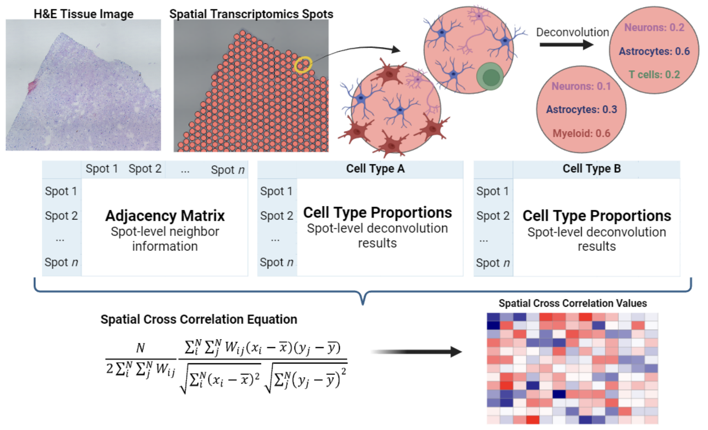

# T-cell_and_glial_pathology_in_PD
- Code and data for The spatial landscape of glial pathology and adaptive immune response in Parkinson's Disease
- Processed R data objects are available here: https://drive.google.com/drive/folders/1OJyNaTvuL29j1WAjF0R0eP8ozcB1IMUU?usp=drive_link

# Spatial cross-correlation
This is a Python module for GPU-accelerated computing of spatial cross-correlation.



## Installation
```bash
$ git clone https://github.com/dalhoomist/T-cell_and_glial_pathology_in_PD.git
```
## Set up Environment
Requirement
```bash
OS: Ubuntu Linux
CUDA Toolkit: v11.2
Python: 3.7
Numpy: 1.21.5
Pandas: 1.3.5
```

## Installing CuPy
Package names are different depending on your CUDA Toolkit version.

v11.2 ~ 11.8 (x86_64 / aarch64)
```bash
pip install cupy-cuda11x
```
v12.x (x86_64 / aarch64)
```bash
pip install cupy-cuda12x
```

## [Important] If the GPU/CUDA environment is not set up, you can create it using Anaconda (or Miniconda), which includes all the requirements.
```bash
$ git clone https://github.com/dalhoomist/T-cell_and_glial_pathology_in_PD.git
$ cd T-cell_and_glial_pathology_in_PD
$ conda env create -f environment.yml
$ conda activate scc
```

## Usage - sample data
- This module, in case of interruption and resumption, skips the already computed part and proceeds with the remaining.
- As the sample outputs are already stored in the sample_data folder, executing a command for sample data will cause the program to terminate immediately upon initiation.
- To observe the normal operation, delete some output from the path ['sample_data/out/1']  and rerun it.
```bash
(scc) $ python scc_cupy.py --input sample_data/ --output sample_data/out/ --order 1 --n 10 --gpu 0
```

## Usage - Multi-GPU
```bash
(scc) $ python scc_cupy.py --input sample_data/ --output sample_data/out/ --order 1 --n 40 --gpu 0 1
```

Parameter
```bash
[--input]  # Directory for both the enrichment matrices and adjacency matrices.
[--output] # Directory for output
[--order]  # The order of adjacency matrices
[--n]      # The number of parallel processes.
[--gpu]    # Assign GPU ID for (one or multi-)GPU processing.
```

## Data Format - input
- Please ensure that the order of barcode names matches for both matrices.
- Datasets are expected to be prepared in a `csv` format.
- Adjacency matrices for input should be

|  | AGTGTGGTCTATTGTG-1 | GCTATCGCGGCGCAAC-1 |  ... |Barcode n|
| :----:| :----: | :----: |  :----: | :----: | 
|AGTGTGGTCTATTGTG-1|0|1|...|0|  
|GCTATCGCGGCGCAAC-1|0|0|...|1|
|...|...|...|...|...|
|Barcode n|0|0|...|0|

- Enrichment matrices for input should be

|  | AGTGTGGTCTATTGTG-1 | GCTATCGCGGCGCAAC-1 |  ... |Barcode n|
| :----:| :----: | :----: |  :----: | :----: | 
|Type_A|0.01306|0.00010|...|0.00022|  
|Type_B|0.33542|0.48310|...|0.07694|
|...|...|...|...|...|
|Type_n|0.05631|0.06172|...|0.04630|

## Data Format - output

| combo_name | local_scc | global_scc | permutation | p_val |
| :----:| :----: | :----: |  :----: | :----: | 
|Type_A_x_Type_A|[-0.0927,...]|-0.0166|[-0.0197,...]|0.27|  
|Type_A_x_Type_B|[0.4968,...]|0.0369|[0.0127,..]|0.04|
|...|...|...|...|...|
|Type_Z_x_Type_Z|[-0.0661,...]|0.0075|0.0072,...]|0.37|

```bash
[combo_name]  # The pairing of two elements' names.
[local_scc]   # Local measurement of spatial cross-correlation.
[global_scc]  # Global measurement of spatial cross-correlation.
[permutation] # The outcome of conducting the permutation test one hundred times.
[p_val]       # P-value test.
```

## Data Directory - input
- Each sample should have matching names for both the enrichment matrices and adjacency matrices.
- You can set the path for the input folder, but ensure that all enrichment matrices are located within the 'enrich' folder.
- The folder containing adjacency matrices should follow the format 'adj_1', 'adj_3', etc., where the latter number indicates the order.

```bash
sample_data/
	├── enrich
    		├── Sample_A.csv
    		├── Sample_B.csv
    		└── ...
	├── adj_1
    		├── Sample_A.csv
    		├── Sample_B.csv
    		└── ...
	├── adj_2
    		├── Sample_A.csv
    		├── Sample_B.csv
    		└── ...
	└── out
```
## Data Directory - output

- Each sample's folder contains distributed computation outputs, which will eventually be concatenated and saved in the designated output path.
- In the output path, the module will automatically generate a folder named according to [--order].
```bash

  sample_data/out/
	        ├── 1 
	            ├── Sample_A_1
	                ├── Sample_A_1_0.csv
	                ├── Sample_A_1_1.csv
	                ├── Sample_A_1_2.csv
	                └── ...
		    ├── Sample_B_1
	    		├── Sample_B_1_0.csv
	    		├── Sample_B_1_1.csv
	                ├── Sample_B_1_2.csv
	    		└── ...
	            ├── Sample_C_1
	    		├── Sample_C_1_0.csv
	    		├── Sample_C_1_1.csv
	                ├── Sample_C_1_2.csv
	    		└── ...
		    ├── Sample_A_1.csv --> (final output for Sample_A, order=1)
	            ├── Sample_B_1.csv --> (final output for Sample_B, order=1)
	            └── Sample_C_1.csv --> (final output for Sample_C, order=1)
	        ├── 2
  		    ├── ...
		    └── ...
```
## TIP

If the GPU process in parallel remains in 'nvidia-smi' even after terminating the module, you can clear it all at once with the following command in Linux bash.
```bash
sudo nvidia-smi | grep 'python' | awk '{ print $5 }' | xargs -n1 kill -9
```

## Reference
- Chen Y. A New Methodology of Spatial Cross-Correlation Analysis. PLoS ONE 10(5): e0126158. (2015) [doi:10.1371/journal.pone.0126158](https://doi.org/10.1371/journal.pone.0126158)
- Jakubiak K. et al. The spatial landscape of glial pathology and T-cell response in Parkinson’s disease substantia nigra. bioRxiv 2024.01.08.574736; (2024) doi: https://doi.org/10.1101/2024.01.08.574736
- Al-Dalahmah, O. et al. Re-convolving the compositional landscape of primary and recurrent glioblastoma reveals prognostic and targetable tissue states. Nat Commun 14, 2586 (2023). https://doi.org/10.1038/s41467-023-38186-1
